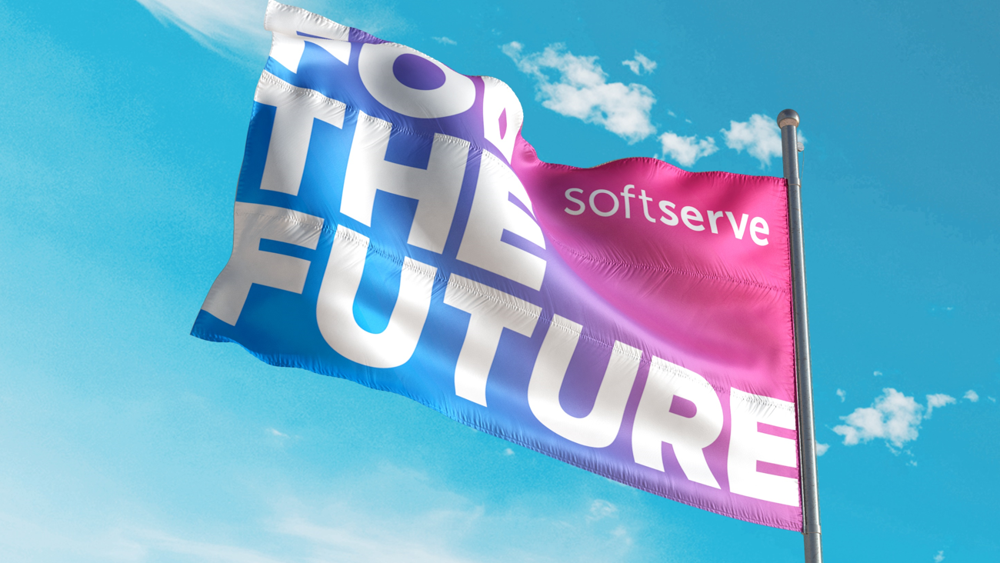
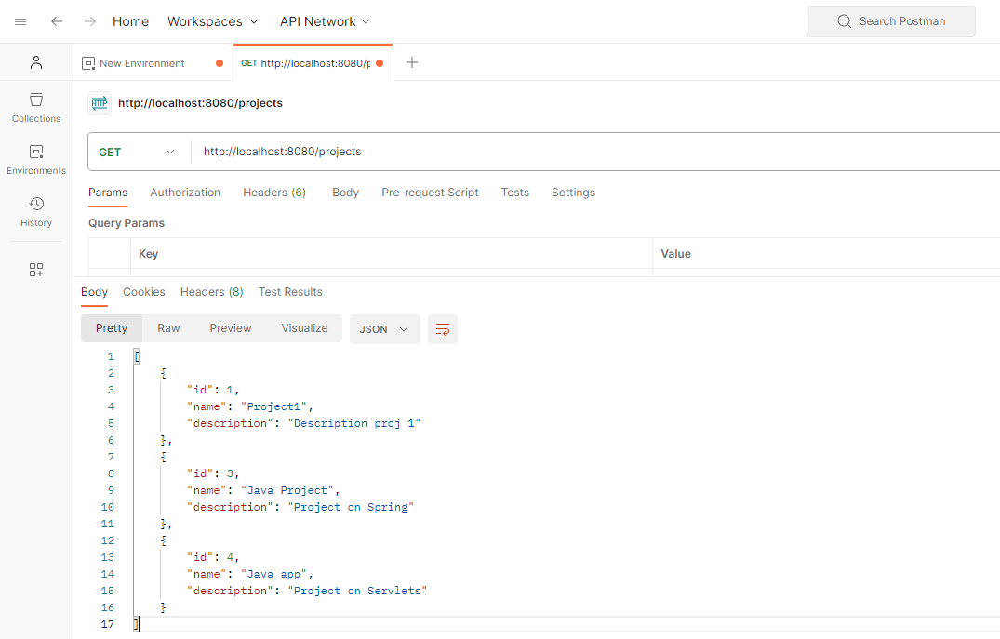

# Userstory project

<br>
<br>

## Project Overview

This project is a web application that allows users to create projects, join them, and manage tasks related to specific stories.

Here is two part: back-end and front-end.

### Key Features

1. **Authentication and Registration:** Users can log in and create an account.

2. **Projects and Stories:** Users can join existing projects, which include various stories - significant events or tasks.

3. **Task Management:** Users can assign and complete tasks (cards or tasks) associated with a specific story.

---
<br>

## BACK-END

<br>
<br>

### Technical Details

- **Programming Language back-end:** Java
- **Database:** MariaDB
- **Required Tools:** Java 17, Maven 3.6.3

### Running the Project

1. **Build the Project:**

   Execute the following command:
```bash
mvn clean package
```

2. **Run the Project:**

After successful building, run the .jar file in the ./target folder:

```bash
java -jar target/[file-name.jar]
```
```text
   The application will start on 8080 port.
```

* **Database Configuration**

In the application's configuration file (application.properties), the path and connection data to the database are obtained from the following environment variables:

    DB_USERSTORYPROJ_URL
    DB_USERSTORYPROJ_USER
    DB_USERSTORYPROJ_PASSWORD

Before running, ensure that the MariaDB database contains a database named userstory and a table named projects with the fields:

```sql
CREATE TABLE projects (
id bigint not null auto_increment,
description varchar(255),
name varchar(255),
primary key (id)
);
```

Wishing you success with the "User Story" project!

---
