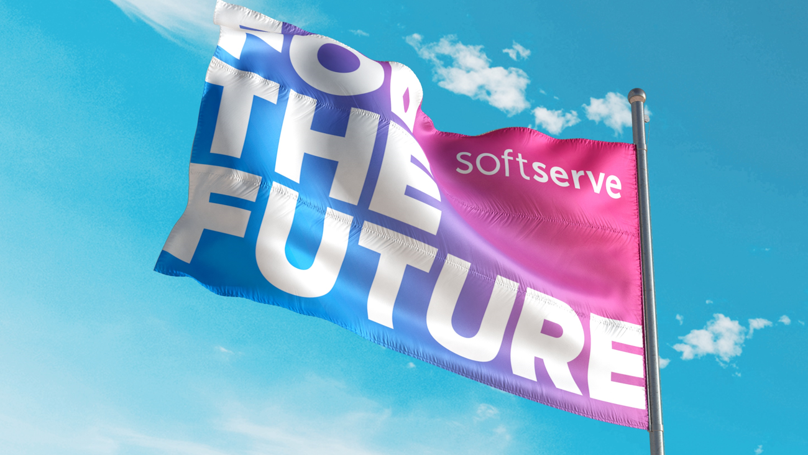
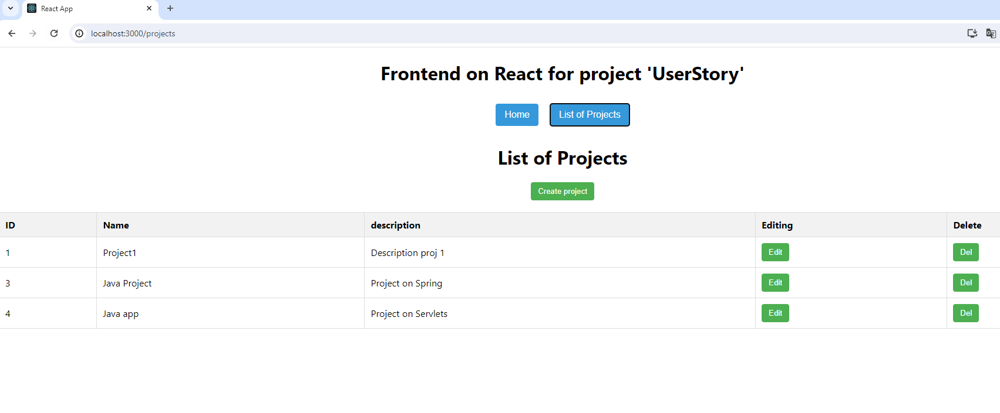

# Userstory project

<br>
<br>

## Project Overview

This project is a web application that allows users to create projects, join them, and manage tasks related to specific stories.

Here is two part:<br>
In folder `userstory_front` is front-end<br>
In folder `userstoryproj_back` is back-end<br>

### Key Features

1. **Authentication and Registration:** Users can log in and create an account.

2. **Projects and Stories:** Users can join existing projects, which include various stories - significant events or tasks.

3. **Task Management:** Users can assign and complete tasks (cards or tasks) associated with a specific story.

---
<br>

## FRONT-END

<br>
<br>

### Technical Details

- **Front-end written on:** React JS
- **Required Tools:** nodejs 20.11.0 version, npm 10.2.4 version

### Running the Project

**Build the Project:**

Execute the following command:
```bash
npm install
```

**Run the Project:**

After successful building you could run the front-end in dev mode:

```bash
npm start
```
The application will start on 3000 port.**


To build the front-end to production run command:

```bash
npm run build
```

```text
    The application will appear in the ./build folder.
    Copy all files in your webserver and configure it.
```

**Back-end Configuration**

The path and connection data to the back-end are obtained from the following environment variable `BACKEND_URL`

Before running, ensure that the back-end was running.

Notes

    The project is at an early development stage, and currently, only CRUD operations for the Project entity are implemented.

---

Wishing you success with the "User Story" project!

---
